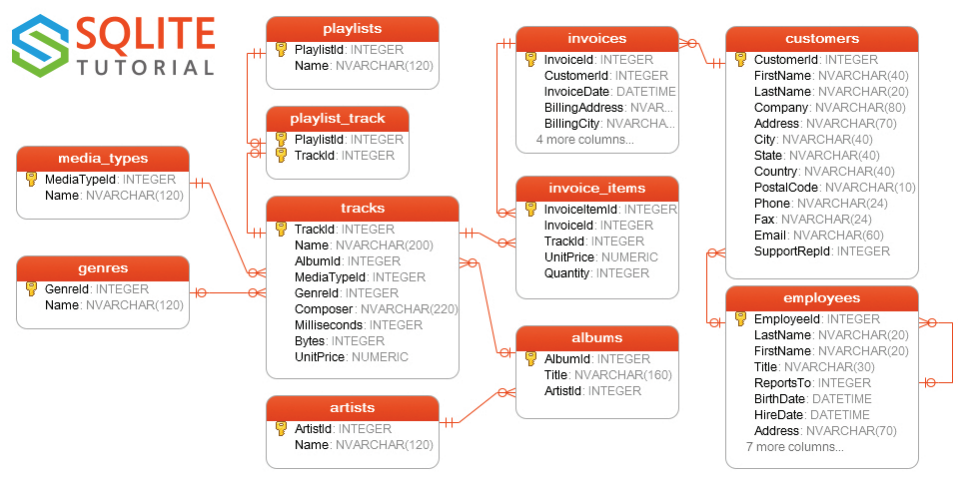

# OOP and SQL

This morning we will be using Object Oriented Programming to interface with the Chinook SQL Database




```python
# SQL Connection and Querying
import sqlite3
# Data manipulation
import pandas as pd
# os is used to create paths to files
import os
# For testing code
from test_scripts.test_class import Test
test = Test()
```

We want to build a ```Chinook``` class that will allow us to easily access information in our database without having to write sql queries every time. We can do this with *attributes* and *methods*.

Our class should have an attribute called ```tables``` that returns a list of tables within the database.

<u><b>Let's review the code for collecting this information.</b></u>

To collect the table names from a sqlite database, we can do the following:

### 1) Open up a connection to our database


```python
path = os.path.join('data', 'chinook.db')
conn = sqlite3.connect(path)
```

### 2) Create a cursor for our database
>Note: A cursor does not need to be created when using ```pd.read_sql```

>But depending on the use case for your code, pandas is not always the best choice!


```python
cursor = conn.cursor()
```

### 3) Execute a sql query


```python
cursor.execute('''SELECT name FROM sqlite_master
                                        WHERE
                                        type = 'table'
                                        AND
                                        name NOT LIKE 'sqlite_%';''').fetchall()
```

As you can see this returns a list of tuples. 

<u>For convenience, we will use list comprehension to change this to a basic list.</u>


```python
tables = cursor.execute('''SELECT name FROM sqlite_master
                                        WHERE
                                        type = 'table'
                                        AND
                                        name NOT LIKE 'sqlite_%';''').fetchall()

tables = [table[0] for table in tables]
tables
```

**Much better**

*Ok ok*, in the cell below, let's create a class called ```Chinook```.

The class should have an ```__init__()``` method.

>Hint: *methods* are just functions inside classes with ```self``` as the first parameter of the function.

>**Example:** 

>```class NameOfClass():
    def name_of_method(self, other_paramaters_if_needed):
        code here```
        

The ```__init__()``` method should have two paramaters:
1. ```self```
2. ```database_path```

Within the ```__init__()``` method:
1. A connection should be opened up to the database using the ```database_path``` variable and saved as a attribute.
2. A cursor attribute should be created.
3. A tables attribute should be created. 

The code to create the  ```tables``` attribute will be almost identical to the code up above. 

The main difference is that the final tables variable should look like this: ```self.tables```.


```python
# Your code here
class Chinook():
    def __init__():
        pass
```

**Let's test your class!**


```python
path = os.path.join('data', 'chinook.db')
data = Chinook(path)
test.run_test(data.tables, 'tables')
```

**Let's add a *method* to our class called ```search_employees```.**

This method should use ```pd.read_sql``` to return a dataframe with a single row for the employee you search for.

<u>```search_employees``` should receive three parameters.</u>
1. ```self```
2. The firstname of an employee.
3. The lastname of an employee.

If the employee is not found, the method should return the string ```'Employee was not found.'``` 


```python
class Chinook():
    def __init__(self, database_path):
        Chinook.conn = sqlite3.connect(path)
        Chinook.cursor = Chinook.conn.cursor()

        tables = Chinook.cursor.execute('''SELECT name FROM sqlite_master
                                        WHERE
                                        type = 'table'
                                        AND
                                        name NOT LIKE 'sqlite_%';''')
        self.tables = [x[0] for x in tables]
    
# --> Your code here <-------------
    def search_employee():
        pass
```

**Let's test your code on an existing employee!**


```python
data = Chinook(path)
test.run_test(data.search_employee('Jane', 'Peacock'), 'employee1')
```

**Now let's test on a nonexistant employee!**


```python
test.run_test(data.search_employee("Joe", "Shmo"), 'employee2')
```

In the cell below describe the difference between an attribute and a method.

-------Use this markdown cell to describe the difference between attributes and methods---------

<u>There are a lot of really helpful ways OOP can be used to iteract with data.</u>

**If you still have time,** I've added some extra functionality to the ```Chinook``` class!

Take a look at it, and in a markdown cell, describe what the additions are doing.

>Note: You may need to google ```setattr```!


```python
class Chinook():
    def __init__(self, database_path):
        Chinook.conn = sqlite3.connect(path)
        Chinook.cursor = Chinook.conn.cursor()

        tables = Chinook.cursor.execute('''SELECT name FROM sqlite_master
                                        WHERE
                                        type = 'table'
                                        AND
                                        name NOT LIKE 'sqlite_%';''')
        self.tables = [x[0] for x in tables]
        
        # =========== NEW ADDITION HERE ==========
        genres = Chinook.cursor.execute('''SELECT DISTINCT(Name) from genres;''').fetchall()
        self.genres = [x[0] for x in genres]
        
        # =========== NEW ADDITION HERE ==========
        for table in self.tables:
            entire_table = pd.read_sql('''SELECT * FROM {}'''.format(table), Chinook.conn)
            setattr(self, table, entire_table)
    
    # =========== NEW ADDITION HERE ========== 
    def query(self, query_string):
        return pd.read_sql(query_string, Chinook.conn)

    
    def search_employee(self, firstname, lastname):
        result = self.query('''SELECT * FROM employees
                            WHERE FirstName = "{}"
                            AND LastName = "{}"'''.format(firstname, lastname))
        if len(result) < 1:
            return 'Employee was not found.'
            
        else:
            return result
        
    # =========== NEW ADDITION HERE ==========
    def albums_by_genre(self, genre):
        return self.query('''SELECT DISTINCT(Title) FROM albums
                            INNER JOIN tracks USING(AlbumId)
                            JOIN genres USING(GenreId)
                            WHERE genres.Name = "{}"'''.format(genre.title()))

    
```
